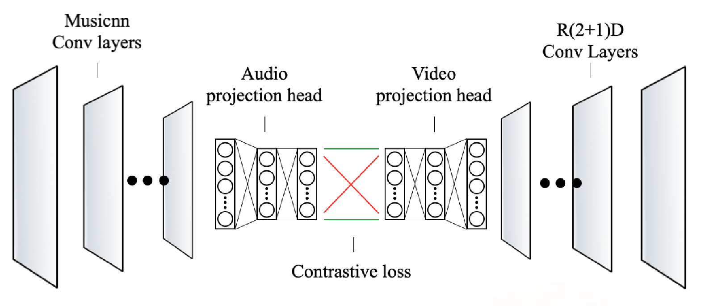

# Mulimodal music video recommendation

This repository contains the code for the masters thesis project on learning multimodal representations for music videos using contrastive learning. The repository is structured as a Kedro (0.17.7) project, which is a framework for producing flexible and reproducible data pipelines. 

The functions used for contrastive learning are located in [the mmnet directory](https://github.com/KarelVeldkamp/Multimodal-Musicvideo-Representation/tree/master/src/thesis_project/mmnet). The code for the pipelines used for learning and downstream tasks can be found in [the pipelines directory](https://github.com/KarelVeldkamp/Multimodal-Musicvideo-Representation/tree/master/src/thesis_project/pipelines). And parameters and settings for the different pipelines are set in the [conf directory](https://github.com/KarelVeldkamp/Multimodal-Musicvideo-Representation/tree/master/conf). The data used for training the model is unfortunately not publicly available, since it consists of the music videos licenced by XITE. The list of million song dataset track id's of songs that were used for the downstream task of music tagging is available [here](https://github.com/KarelVeldkamp/Multimodal-Musicvideo-Representation/tree/master/data/08_reporting/msdids.txt)

